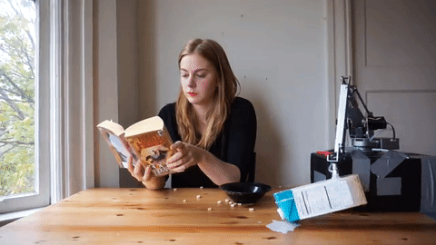

# Saltapult

Project documentation for the **Design for Physical Prototyping** course 2022/23 focusing on the topic of **Uncomfortable Devices**.

## Abstract

- Missing

Shortly summarize the intentions and ideas behind your project. 
Lorem ipsum dolor sit amet. This project builds upon the idea of [Chindōgu](https://en.wikipedia.org/wiki/Chind%C5%8Dgu), the practice of inventing ingenious everyday gadgets that seem to be ideal solutions to particular problems, but which may cause more problems than they solve. Lorem ipsum dolor sit amet.

## Concept

The initial brainstorming in the DPP course paved the road for the Saltinator. While the first ideas where rather tame, it didn't take long to end up with some crazy concepts which are impossible with current technology. But this information dumping helped with coming up with something that was actually buildable.

After a private remote session we reduced our possible candidates to three ideas.
* A hairdryer attachment that insults you when you use the highest setting.
* A odorizant that tells you about their feelings and what kind of problems they are facing currently.
* A self driving vacuum cleaner that insults you and some other features that have been lost in translation.
* A date buddy that analyzes your breath and sprays peppermint breath refresher accordingly.
* ... and finally a laundary basket that throws the laundary back at you once it's full and also keeps insulting you.

In retrospect it's pretty clear that the "insulting" part was our main driver for most ideas, which most likely pairs with that fact that the idea of an insulting machine seems uncomfortable at first, but in the end it's actually quite the opposite. We insult each other all the time, it's a form of comedy and it's especially hard to convey these often highly emotional outbursts through cheap speakers and with no facial impressions.

### Underlying Motivation

The laundary basket is an object that gets way too full and never fully cleared, which is a problem. To solve this, the Saltinator not only limits the amount of dirty laundary that can be placed inside, but also reminds the user by tossing all it's contents once it's too full. To further make the user uncomfortable, it insults them everytime they place an item in the basket. The individual user can freely device where this device makes the most sense, especially since it's somewhat space-saving.

### The Initial Plan

The biggest issue was conceptualizing how the launching mechanism works. Due to the box shape we did not want to use a vertical approach. So instead we first theorized over using secondary wooden plate that is pulled towards a motor using a rope which gets cut, causing the launch. The springs were located in the bottom. To reduce the stress on the rope and motor we also wanted to fixate the moving plate using some sort of mechanism, which required a good chunk of research. If the motor did not bring enough torque we would have oppted for a more used centered approach, having the user fixate the plate. Another problem that came up immediately was using the razor, as the rope needs to be replaced, either automatically or by the user. For the indication we initially planned on using an infrared sensor that checks if the signal is interrupted. If the interruption is short it will play an insult. A longer time period will trigger the launch sequence.

## Implementation

With the concept our next step was to create the box and implement the needed components. To do so, several iterations were needed to get the electronic working.
Bevore we could start with the project a simple version of our concept needed to be created. This first prototype should be simple to created, present the main function of the concept and should be fast built. To do so the first test system was built.

### Paper prototype

The first prototype is basically build with a shoebox. A smaller box is used as base plattform for the main box. A plastic asian delivery food box is used for putting the cloth in. The plastic box is glued down to the smaller cardboard box. To build the catapult system four hookes are screwed in the cornes of the smaller box and four to the top of the shoebox. Another hooked is screwed in the middle of the bottom side of the smaller box. To make sure that someone can pull down the smaller box, a hole is made in the middle of the bottom side of the shoebox. A string is put through the hole connected to the hook at the bottom side of the smaller box. To make the catapult work four rubber bands are used as springs to create a connection between the four hooks at each box. To refill the box cut a hole in the same size of the plastic into the top of the shoebox. To test the catapult, objects are placed into the plastic box and string is pulled down. Let the string out and the box is going upwards.

With the first prototype we found out that we can not build the catapult with cardboard. Cardboard is not robust enough and so we decided to go with wood and do further tests with it.

### Testing components

To get a better understanding of how the components work and how to use them together the components were tested.
In this subsection describes the components and how they got tested and used.

The first component we tested is the infrared receiver. If infrared light hits the reiceiver, a signal is generated which can be detected and used from the arduino. Becuase of the short distance which they receiver needs to detect the light we decided to take an ultrasound sensor. The advantage of the ultrasound sensor is that it can detect detect interrupts more easily. The basic funcionality of an ultrasound sensor is that is sends out an ultrasound which get reflected. When the reflection hits the ultrasound sensor a distance is calculatet with the time which past until the sound got recognized. Using this funcionallity allows to detect when the distance is changing and react to it. To connect the ultrasound sensor to the arduino only four wires are needed; one to the voltage source (5V), one to the ground and the other twos to a choosen digital output.

The next step was to try out the motor. We needed to figure out how much voltage and current it needs. To do so we connected the motor to a laboratory power supply with 12V. To messure the needed current wo contected a multimeter in series with the engine and the power supply. The result was 0.2A so a good value for using a 12v power supply. To test the strength of the motor we glued a string to the shaft of the motor and put some weight on it. It is possible with the motor to lift up a screw jack. We tested the motor with the new 12V power supply but after realizing that we also need a mechanic to hold the plate which needs at least 24V we needed to change the power supply. As power supply we got a 24V one. To regualte the voltage a step down is used. A step down is a component which gets a input supply and regulates the voltage over a turning resistor. To get the right voltage the input of the step down was connected to the power supply, the output to the multimeter. To set the right voltage a screw has to be turned. 

To be able to controll the motor a H-Bridge is used. This component gets an input voltage and has a 5V output. There are four outputs which allows to connect two motors. To controll the H-Bridge six pins are connected to the arduino. Setting two of the four controll pins (LN1-LN4) to HIGH activates the rotation of the motor. The connections ENA and ENB are used to set the speed.

As realease meachnism a solenoid is used. If voltage is inductaded the shift is able to to move allows to hold our plate. To test the funcionality the solenoid is connected to the laboratory power supply which has an output of 24V. To avoid that the solenoid is activated to long we decided to take the black shaft instead of the screw shaft. The solenoid only has an input and output, so a relais is needed to switch the state of the solenoid. To do so the power supply is connected to the relay. The relais has two outputs normally open (NO) and normally closed (NC). To get the effect of a button the solenoid needs to be conected to the normally open conection, because this one get only activated after the arduino puts the output to high. Normally closed is already connected to the power supply and would get to the open state after the arduino sends a high signal. To test the relais-solenoid combination the power supply and the arduino are getting connected to the relais. The solenoid is connected with with ground (GND) and the normally open pin on the relay. Checking the funcionality is simple, just upload the the Relay code to the arduino.

For insulting we used the sparkfun mp3 audio shield. This is a shield is made for the Arduino Uno. It is designed to fit perfectly to the contection of the Arduino Uno, thus no wires are needed. To receive a sound headphones where used in the first iteration. To use the shield the mp3 library of the shield needs to be importat to the arduino software. To test it, one of the example codes can be used. We used the "Filereader" to test if the shield is working. To use it for our own project the setup as well as the start playing part were copied from the "Filereader". To improve audio an old speaker is used.

The mp3 shield gave us some problem, see chapter Learnings. To get rid of the problems a second arduino is used. The arduino Uno is used to check the interrupts with the ultrasound sensor and plays the according audio. The Mega 2560 is used to controll the motor and the solenoid. To make sure that the Mega knows when it is allowed to enable the solenoid a communication between uno is necessary. We tried two different approach: directly communication via digital outputs (UART) and via communication pins (I2C). A sample code of a slave and master system is in the Code folder.

The last component we needed to test are the springs. We bought several kinds of springs at the local tool shop. We chooesed steel springs with a length of 4cm. For testing we took two wood bars and screwed four hooks in each. The springs are connected to the hooks. We tested the strength of the springs by trying to pull the two bars apart by hand and with the motor. Both worked pretty well and so we decided to go with the choosen springs.

### Presentation prototype

After testing all components and how we have to use them, it is finally time to build our prototype. 
Before we started to connect all the components a wiring plan was created, see figure []. This avoid putting the wrong wire to the wrong pin and also helps to understand what needs to be connected to to which component. To avoid any damage to the components a switch toggler was build in to have the opportunity to turn off the whole thing just with one whip. We could also plug out the power supply but that would take longer and also some times it is difficult to get the plug out realy fast.

#### Code
In the folder Code are all the code snipets which where used for testing the components. The task for the final prototype was to combine all the snippets to one file, or in our case in two files.

##### Uno
The job of the uno is to detect if something is thrown in the box. If so the distance, which gets detected from the ultrasound sensor, changes and the uno activates the sound modul. The plastic box has lenght about 25cm. To avoud that the arduino gives activates the signal all the time it should only do so when the distance is shorter than 20cm. The goal here was to detect the point when the box is full. There are two possible ways to do so: if the distance is shorter than 20cm wait some seconds and check it again; or using a counter to detect if the distance is still shorter and after a given value the arduino knows that the box is full.
We tried both solution and found out that checking the distance and waiting for some time is not the best solution. It is possible that you throw something in and after some seconds you throw again something in which would be detected as a full box. Therefore, the interruption counter is our solution. If something changes the distance below 20cm the counter is increased by one. In the next loop the distance is checked again, if it is still below 20cm than the counter is increased again by on, otherwise the counter is set to zero. If the counter reaches a value of onehundred the systems detects it as full and a self-destruction sound is played which would lead to enable the solenoid and activating the catapult.

##### Mega
The main job of the mega is to enable the solenoid; activating the motor to coil up the string which brings the plate to a certain position; deactivate the solenoid to hold the plate; rotate the motor in the opposit direction to unwind the string to avoid that the motor will be draged by the plate, and wait until the uno sends a signal to start the catapult process which enables the solenoid and shoots the plate upwards. The base input is to send a HIGH signal over a digital output to the solenoid to enable it. To turn the motor the four output pins need to be set to a predefined configuration of HIGH and LOW which leads to a left or right rotation. The ENA and ENB decide how fast the motor is rotating. To avoid a abrupt start and stop the values of ENA and ENB are in-/decreased with a for loop. The duration of the motor is set by a time limit.

#### Contingency plan
Notfallplan

#### Building the box

- final prototype
- anleitung wie man es baut, code einbauen und schaltplan werweis auf materials

- Box bauen

## Materials and tools

What materials and hardware did you use in your iterations and your final prototypes? Did you modify any ready-made devices? Did you build it from scratch? What tools did you use to implement your prototype?

The main materials for this project were reused. All the components from the box where made out of wood which we already had at home such as from old chairs, shelves and fance. A list of all components used are displayed in the table below:

Material liste

## Learnings

- was haben wir gelernt.
- elektronik
- baun

## Conclusion

Shortly summarize your project implementation process and the resulting outcome.
What problems and limitations did you face? What experiences did you make 

{: .note }
Edit this page and all the subpages according to the specifics of your project. You don't need to use the provided headlines, just keep it well structured. If one part of the documentation gets too lengthy put it into a subpage.
