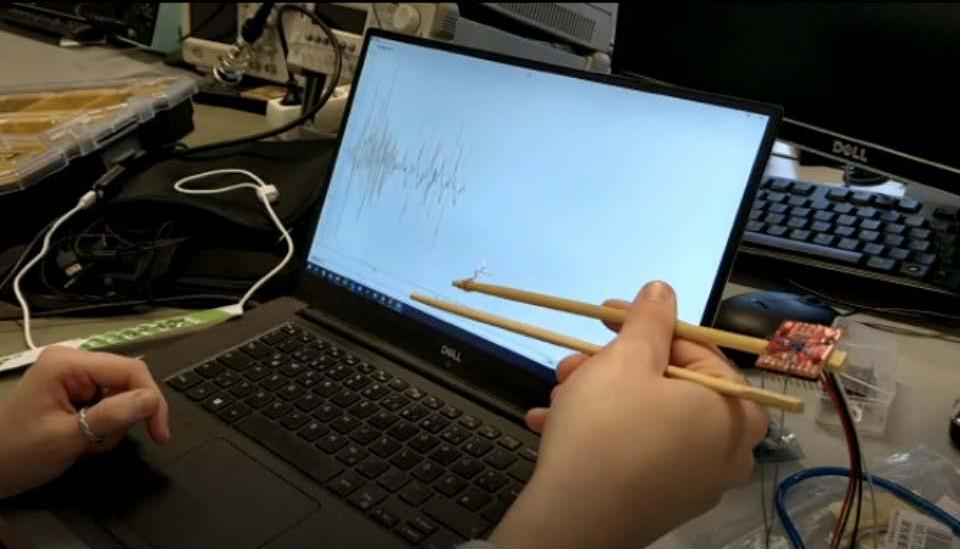

# Saltapult

Project documentation for the **Design for Physical Prototyping** course 2022/23 focusing on the topic of **Uncomfortable Devices**.

## Abstract

Shortly summarize the intentions and ideas behind your project. 
Lorem ipsum dolor sit amet. This project builds upon the idea of [Chindōgu](https://en.wikipedia.org/wiki/Chind%C5%8Dgu), the practice of inventing ingenious everyday gadgets that seem to be ideal solutions to particular problems, but which may cause more problems than they solve. Lorem ipsum dolor sit amet.

## Concept

The initial brainstorming in the DPP course paved the road for the Saltinator. While the first ideas where rather tame, it didn't take long to end up with some crazy concepts which are impossible with current technology. But this information dumping helped with coming up with something that was actually buildable.

After a private remote session we reduced our possible candidates to three ideas.
* A hairdryer attachment that insults you when you use the highest setting.
* A odorizant that tells you about their feelings and what kind of problems they are facing currently.
* A self driving vacuum cleaner that insults you and some other features that have been lost in translation.
* A date buddy that analyzes your breath and sprays peppermint breath refresher accordingly.
* ... and finally a laundary basket that throws the laundary back at you once it's full and also keeps insulting you.

In retrospect it's pretty clear that the "insulting" part was our main driver for most ideas, which most likely pairs with that fact that the idea of an insulting machine seems uncomfortable at first, but in the end it's actually quite the opposite. We insult each other all the time, it's a form of comedy and it's especially hard to convey these often highly emotional outbursts through cheap speakers and with no facial impressions.

Here you could summarize your project proposal. How did you plan to build your prototype? Did you arrive at your idea immediately or did you iterate over it? Describe your process. 

## Implementation

- Sebi

Describe how you implemented your project. Which iterations did go through? What did work and what did not work? Did you adapt your original idea to practical difficulties during implementation?

### Iteration A

First Prototype
Lorem ipsum dolor sit amet.

### Iteration B
- Tests of the parts of its own
Lorem ipsum dolor sit amet.

### Iteration C

- final prototype
- anleitung wie man es baut, code einbauen und schaltplan werweis auf materials

- Box bauen

Lorem ipsum dolor sit amet.

## Materials and tools

What materials and hardware did you use in your iterations and your final prototypes? Did you modify any ready-made devices? Did you build it from scratch? What tools did you use to implement your prototype?

Material liste

## Learnings

- was haben wir gelernt.
- elektronik
- baun

## Conclusion

Shortly summarize your project implementation process and the resulting outcome.
What problems and limitations did you face? What experiences did you make 

{: .note }
Edit this page and all the subpages according to the specifics of your project. You don't need to use the provided headlines, just keep it well structured. If one part of the documentation gets too lengthy put it into a subpage.
