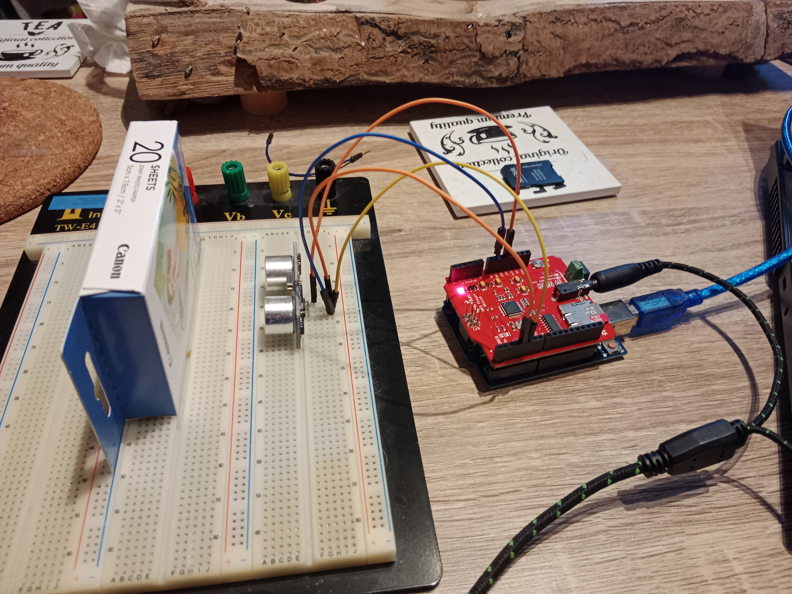
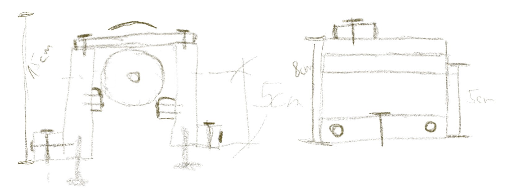
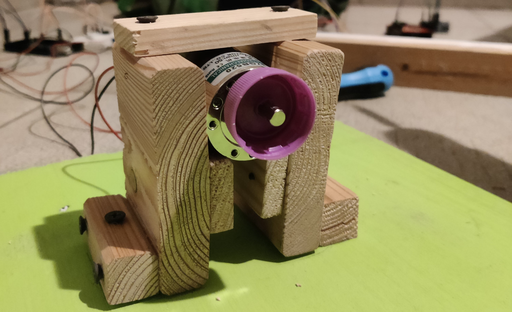
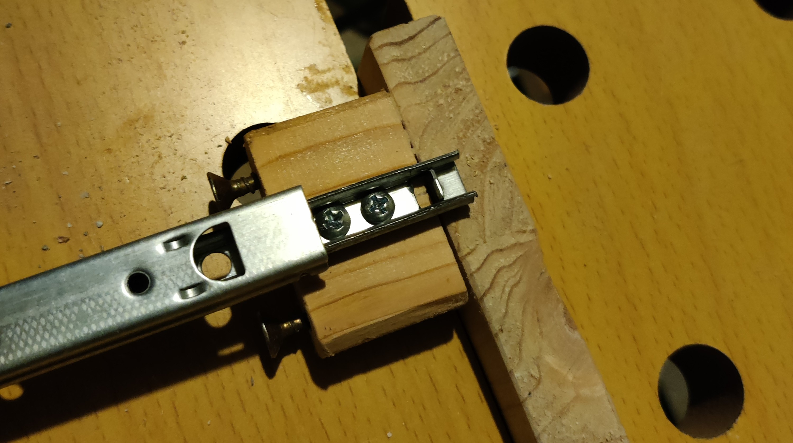
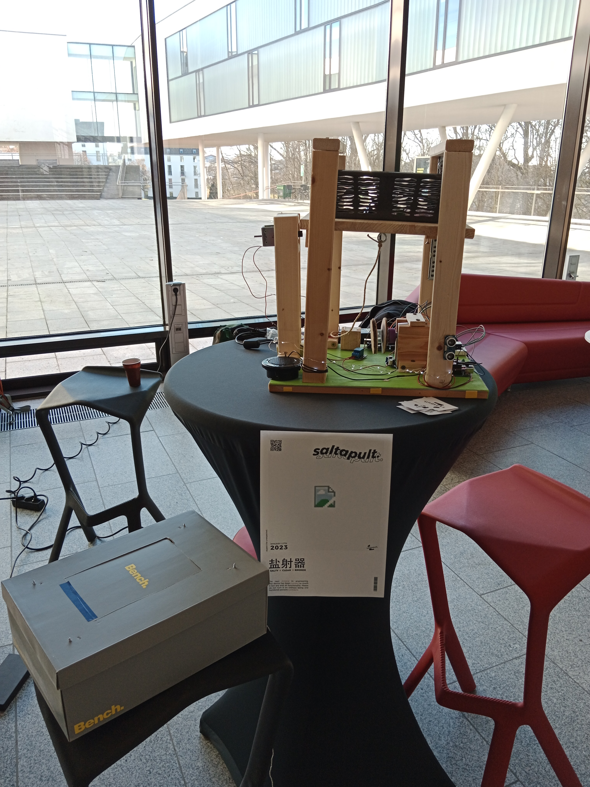

# Saltapult

Project documentation for the **Design for Physical Prototyping** course 2022/23 focusing on the topic of **Uncomfortable Devices**.

## Abstract

This project builds upon an idea we came up with after several brainstorming sessions. The main object of Saltapult - a smart (at least in some way) laundry basket - is to detect if and how much dirty cloth a user has thrown into it. For each new piece, the user gets insulted. A full basket results in an epic launch that wakes the user up, unexpected, in the best case. This paper will guide the reader through all processes of the project, from the early concept and motivation, to the different testing states/implementations, our first prototype, building the final prototype, the presentation and finally to our conclusion.

## Concept

The initial brainstorming in the DPP course paved the road for the Saltinator. While the first ideas were rather tame, it didn't take long to end up with some crazy concepts, which are impossible with current technology. But this information dumping helped with coming up with something that was actually buildable.

After a private remote session, we reduced our possible candidates to five ideas:
* A hairdryer attachment that insults you when you use the highest setting.
* A odorizant that tells you about their feelings and what kind of problems they are facing currently.
* A self-driving vacuum cleaner that insults you (and some other features that sadly have been lost in translation).
* A date buddy that analyzes your breath and sprays peppermint breath refresher accordingly.
* ... and finally a laundry basket that throws the laundry back at you once it's full and also keeps insulting you.

In retrospect, it is pretty clear that the "insulting" part was our main driver for most ideas, which most likely pairs with that fact that the idea of an insulting machine seems uncomfortable at first, but in the end it's actually quite the opposite. We insult each other all the time, it's a form of comedy, and it is especially hard to convey these often highly emotional outbursts through cheap speakers and with no facial impressions.

### Underlying Motivation

The laundry basket is an object that gets way too full and never fully cleared, which is a problem. To solve this, the Saltinator not only limits the amount of dirty laundry that can be placed inside, but also reminds the user by tossing all it's contents once it's too full. To further increase the unconformability of the user, it insults them every time they place an item in the basket. The individual user can freely where to place this device, especially since it's somewhat space-saving.

### The Initial Plan

The biggest issue was conceptualizing how the launching mechanism works. Due to the box shape, we did not want to use a vertical approach. So instead we first theorized over using a secondary wooden plate that is pulled towards a motor using a rope, which gets cut, causing the launch. The springs were located in the bottom. To reduce the stress on the rope and motor, we also wanted to fixate the moving plate using some sort of mechanism, which required a good chunk of research. If the motor did not bring enough torque, we would have opted for a more user centered approach, having the user fixate the plate. Another problem that came up immediately was using the razor, as the rope needs to be replaced, either automatically or by the user. For the indication, we initially planned on using an infrared sensor that checks if the signal is interrupted. If the interruption is short, it will play an insult. A longer time period will trigger the launch sequence.

## Implementation

With the concept, our next step was to create the box and implement the needed components. To do so, several iterations were needed to get the electronic working.
Before we could start with the project, a simple version of our concept needed to be created. This first prototype should present the main function of the concept and be easy to build.. which resulted in the first prototype, the cardboard approach.

### Cardboard prototype

The first prototype was built out of a shoe box. A smaller box serves as the base platform for the main box. A plastic asian food box is used to insert the cloth. The plastic box is glued to the smaller cardboard box. To build the catapult system, we screwed four hooks into the corners of the smaller box and four hooks into the top of the shoe box. Another hook is screwed into the center of the underside of the small box. In order for someone to pull down the small box, a hole is made in the middle of the bottom of the shoe box. A string goes through the hole that connects to the hook on the bottom of the small box. To make the catapult work, four rubber bands act as springs attached between the four hooks on each box. To refill the shoebox, cut a hole the same size as the plastic in the top of the shoebox. To test the catapult, one places an item in the plastic box and pulls down the string.

With the first prototype we found out that we can not build the catapult with cardboard. Cardboard is not robust enough, so we decided to go with wood and do further tests with it.

### Testing components

To get a better understanding of how the components work and how to use them together the components were tested.
This subsection aims to describe the components and how they got tested and used.

The first component we tested is the infrared receiver. If infrared light hits the receiver, a signal is generated, which can be detected and used from the Arduino. Because of the short distance, which the receiver needs to detect the light, we decided to use an ultrasound sensor. The advantage of the ultrasound sensor is, that it can detect interruptions more easily. The basic functionality of an ultrasound sensor is, that is sends out an ultrasound, which gets reflected. When the reflection hits the ultrasound sensor, the distance to the interference is calculated using the time past until the sound got recognized. Using this functionality allows detecting, when the distance is changing and react to it. To connect the ultrasound sensor to the Arduino, only four wires are needed; one to the voltage source (5V), one to ground and the other two to a chosen digital output.

The next step was to try out the motor. We needed to figure out how much voltage and current it needs. To do so, we connected the motor to a laboratory power supply with 12V. To measure the needed current, we connected a multimeter in series with the engine and the power supply. The result was 0.2A, so a good value for using a 12V power supply. To test the strength of the motor, we glued a string to the shaft of the motor and put some weight onto it. We could lift a screw jack using the motor. Initially we tested the motor with the new 12V power supply, but after realizing that we also need a mechanic to hold the plate, which needed at least 24V, we needed to change the power supply, resulting in a switch to 24V. To regulate the voltage, a stepdown is used. A stepdown is a component, which gets an input supply and regulates the voltage over a turning resistor. To get the right voltage, the input of the stepdown was connected to the power supply, the output to the multimeter. To set the right voltage, a screw has to be turned. 

To be able to control the motor, a H-Bridge is used. This component gets an input voltage and has a 5V output. There are four outputs, allowing the user to connect two motors. To control the H-Bridge, six pins are connected to the Arduino. Setting two of the four controll pins (LN1-LN4) to HIGH activates the rotation of the motor. The connections ENA and ENB are used to set the speed.

As release mechanism a solenoid is used. If voltage is inducted, the shift is able to move, allowing it to hold our plate. To test the functionality, the solenoid is connected to the laboratory power supply, which has an output of 24V. To avoid that the solenoid is activated too long, we decided to take the black shaft instead of the screw shaft. The solenoid only has an input and output, so a relais is needed to switch the state of the solenoid. To do so, the power supply is connected to the relay. The relais has two outputs: Normally open (NO) and normally closed (NC). To get the effect of a button, the solenoid needs to be connected to the normally open connection, because this gets only activated after the Arduino puts the output to high. Normally, closed is already connected to the power supply and would get to the open state after the Arduino sends a high signal. To test the relais-solenoid combination, the power supply and the Arduino are getting connected to the relais. The solenoid is connected with ground (GND) and the normally open pin on the relay. Checking the functionality is simply done by just uploading the relay code to the Arduino.

For insulting, we used the Sparkfun-MP3-Audio-Shield. This shield is made for the Arduino Uno. It is designed to fit perfectly to the connection of the Arduino Uno, thus no wires are needed. Testing the sound in the first iteration was done using headphones. To use the shield, we first need to establish a mp3 library using the Arduino software. It can easily be tested using one of the example codes. We used the "FileReader", to test if the shield is working. To use it for our own project, the setup, as well as the start playing part, were copied from the "FileReader". To improve audio, an old speaker is used. Creating the insults for the shield is tricky, but knowing that only mp3 and .WAV data is working, gathering audio samples was not that bad. To convert the samples, a text-to-speech online service was used. The insults are from online forums and are mostly about smelling. The client service allows to input the insults via text, which can directly be downloaded afterward. The file name needed to be changed to a format like 000x.mp3 or 000x.wav. A 32 GB SD card has been used for storage.

The MP3-Shield gave us some problems - see chapter Learnings. To get rid of the problems, a second Arduino has been used. The Arduino Uno is used to check the interruptions with the ultrasound sensor and plays the according audio. The Mega 2560 is used to control the motor and the solenoid. To make sure that the Mega knows when it is allowed to enable the solenoid, a communication between Uno is necessary. We tried two different approaches: directly communication via digital outputs (UART) and via communication pins (I2C). A sample code of a slave and master system is in the code folder.

The last component we needed to test was the springs. We bought several kinds of springs at the local tool shop. We have chosen steel springs with a length of 4 cm. For testing, we took two wood bars and screwed four hooks in each. The springs are connected to the hooks. We tested the strength of the springs by trying to pull the two bars apart by hand, and after with the motor. Both worked pretty well, and so we decided to go with the middle strength springs.

### Presentation prototype

After testing all components and how we have to use them, it is finally time to build our prototype. 
Before we started to connect all the components, a wiring plan was created - see the next figure. This avoids putting the wrong wire to the wrong pin and also helps to understand what needs to be connected to which component. To avoid any damage to the components, a toggle switch was build in to have the opportunity to turn off the whole thing just with one press of a button. We could also plug out the power supply, but that would take longer and oftentimes cannot be reached in time.

#### Code
In the folder "Code" are all the code snippets, which were used for testing the components. The task for the final prototype was to combine all the snippets to one file, or in our case in two files.

##### Uno
The job of the Uno is to detect if something is thrown in the box. If so, the distance, which gets detected from the ultrasound sensor, changes and the Uno activates the sound module. The plastic box has a length of about 25 cm. To avoid that the Arduino activates the signal all the time, it should only do so when the distance is shorter than 20 cm. The goal here was to detect the point when the box is full. There are two possible ways to do so: 
* If the distance is shorter than 20 cm, wait some seconds and check it again
* Using a counter to detect if the distance is still shorter and after a given value, the Arduino knows that the box is full.
We tried both solution and found out that checking the distance and waiting for some time is not the best solution. It is possible that you throw something in and after some seconds you throw again something in, which would be detected as a full box. Therefore, the interruption counter is our solution. If something changes the distance below 20 cm, the counter is increased by one. In the next loop the distance is checked again, if it is still below 20 cm than the counter is increased again by one, otherwise the counter is set to zero. If the counter reaches a value of one hundred, the systems detect it as full and a self-destruction sound is played, which would lead to enabling the solenoid and activating the catapult.

##### Mega
The main job of the Mega is to enable the solenoid, which results in the following steps:
1) Activating the motor to coil up the string, which brings the plate to a certain position
2) Deactivating the solenoid to hold the plate
3) Rotating the motor in the opposite direction to unwind the string, avoiding that the motor will dragged by the plate
4) Wait until the Uno sends a signal to start the catapult process, which enables the solenoid and shoots the plate upwards. 
The base input is to send a HIGH signal over a digital output to the solenoid to enable it. To turn the motor the four output pins need to be set to a predefined configuration of HIGH and LOW, which leads to a left or right rotation. The ENA and ENB decide how fast the motor is rotating. To avoid an abrupt start and stop, the values of ENA and ENB are in-/decreased with a for loop. The duration of the motor is set by a time limit.

#### Contingency plan
While building combining the components and create one code, a problem occurred. The communication between both Arduinos stopped working.
Although it worked before in the combined version, an error occurred, and it was not possible to send data from one Arduino to the other one. Even with the base version of just setting a digital output. Therefore, a new solution was needed. A button was the simplest way to demonstrate the functionality of the system.
With this new element, the behavior of the code from the Mega changed just slightly. Instead of waiting for the signal from the Uno, now the button is used to represent this communication. When it is pressed, the solenoid is activated and the platform is able to move upwards.

Another problem was, that normally a gear is used to mount an object to the shaft of the motor. We could not get a gear for our project. Therefore, we needed to think about a solution to mount our winch to the motor. Our first idea was to design a wench in a 3D program like Fusion and print it with a 3d printer. We withdrew this idea because we had no 3D printer in reach. Another idea was to craft something on our own. We took a regular plastic bottle and cut off the bottleneck. A soldering iron was used to create a hole into the bottle cap. To create the winch, cardboard and foam rubber was cut into circles and glued to the bottleneck. To mount the string to the bottleneck, a hole was created with the soldering iron. The string is pushed through the hole and fixed with a washer (Beilagscheibe). At the end, the bottle cap was assembled to the motor shaft and the bottleneck to the cap.

#### Building the box

As with most things, the beginning turned out to be quite difficult. It was pretty clear from the get-go that we'd use wood as the main structural material, not only for its durability, but also ease of access. We had to consider the g-forces that get applied to the material when the motor pulls the platform towards the ground and releases it. Similar stress is placed on the solenoid, trying to hold the platform down. One concern we initially had was the weight, especially considering the quality of rope we'd use and how the motor truly is, which quickly became obsolete as mentioned in the other tests. Luckily we both had quite an array of broken wood furniture, old unused processed wood pieces and other wooden elements that could be used.

#### Measuring & Praying

We figured it made the most sense to measure all parts and calculate a minimum width and height for the base. We had to make a choice, however. Do we want to add the supporting pieces length- or widthwise, which depended on two main factors: 
* Considering we only had one solenoid, it would make more sense to place it on the length side, as the wiggle room would be reduced by quite a margin. 
* The other problem is that we only have two supporting rails, making it quite difficult to find a promising position for all of these parts. 
Additionally - thinking we initially had two solenoids - it did not make much sense to place both of them on the width side, because the overall length of the prototype would be quite large. After some brainstorming, we came to a conclusion:

We switch from a box approach to only having four supporting towers, allowing people to see the inner workings of our prototype and also easier debugging. Only having one solenoid combined with the open space and only having two rails (drawer slides) further drove into one possible build configuration: Place the support on the length side, add supporting rails diagonally from each other and place the solenoid to the width side. With the initial headaches out of the way, we finally started building and choose a big green wooden piece as the base of our prototype.

#### Fixating the motor

The first task we tackled was fixating the motor. We started by measuring the wooden base and finding the center, which was important for the placement of the rope to avoid torque towards the sides and unnecessary stress for our components. We also needed to consider the height of the motor holding component, as it might have interfered with the movable platform if the supporting pedestals are not high enough. Furthermore, we also needed to securely mount the motor to hold steady, while simultaneously not break the motor holder due to the stress applied. We opted for additional support by placing a wooden extension on each side. To fixate the wood, we used an array of screws we had available in my little workshop. To further improve stability, we added a slight angle, so the motor would naturally get stuck once the distance gets too small. The final height came out to be 15 centimeters.

#### Supporting pillars

Switching from a box to a more open design allowed for a lot more flexibility in several aspects. After some trial and error trying to determine the needed minimum height for the middle platform, we finally started building.. only to realize that we mounted the platform on the wrong socket of the drawer slide. The basic idea was to use six pieces of wood, four attached widthwise, two supporting and combining the opposite pillars on the top. This would also be the place we attached the springs to later on. After a good chunk of wood work and drilling in a rather unsafe manner, we finally managed to complete the basic structure of the supporting/catapult element and attached it to the base, which marked the beginning of the testing and electronic phase. (If you ever do wood work, be sure to either use strong enough wood or get some metal plates to further support screws that face a lot of stress.. but more on that later ;-) )

#### The presentation

While building the box of the prototype, we found out that the winch is not that stable as it should be. The motor is able to rotate it without trying to pull down the plate, but with the plate the force of the springs was too much and the winch stayed on the same position. The other thing we noticed is that one solenoid is not enough to hold the plate. Therefore, we decided to go with a prototype which just shows how it should work. The solenoid and the motor never interact with the hanging plate, and so no force is used to it. To show how the initial idea works, the user has to pull down the plate and hold it until someone press the button.

At the presentation, we got a lot of feedback of how well-designed it. Everyone liked the idea and know exactly which problem we addressed.
Even the mechanism did not work as planned, everyone understood what we tried to do and liked it. The highlight was definitely the insults.
The presentation time was great because we were able to display our prototype and talk about our ideas and steps and what we learned while building it. 

## Materials and tools

The main materials for this project were reused. All the components from the box were made out of wood which we already had at home such as from old chairs, shelves and a fence. A list of all components used are displayed in the table below:

### Material liste

## Learnings
While building our prototype, a lot of new things were learned, such as how the components work, how to write Arduino code or even how to somewhat properly design a mechanism. Sometimes you need to think out-of-the-box to find a solution, like the wench. Even though there are some tutorials out there that show how to use the different components, combining them is another story and can lead to some problems. This chapter sums up our learnings and should be a help for people who try to do something similar as we did.

The first thing we definitely learned is that you need to try things out. Connect it with a power supply and look what it does. It helps a lot to understand the behavior of the component and how it can be used. We did that several times - with the ultrasound sensor, the motor and the solenoid.

Looking up already existing code helps a lot in testing things out. There are a lot of different code samples out there for these components. Analyzing them and adapting them for the project helped a lot to create the final code script. Even though some tutorials are not that helpful, some of them can save a lot of time. Also, YouTube is your best friend. :-)

The most difficult part was the MP3-Shield. The reason why it was so complicated is that the Uno has less output pins. The shield uses some of them, and the provided document from Sparkfun did not help a lot. They don't describe which pins are used and which one are free. Therefore, we tried to figure out which pins are needed for playing audio with the speaker. At the end, the shield needs all digital pins expect of PIN 4/5 and all analog pins. The pins are already used by the ultrasound sensor, so there were no free pins for the other components. To make things easier, we changed the Arduino from Uno to Mega 2560 which has more digital output pins and would fit perfectly for our project. But, although there were a documentation about how to connect the shield with the Mega, the shield did not work. After two and a half days of trying out different ways to connect the shield with the Mega, even changing some parts in the original library, the shield did not work. So to make our project work, we decided to use both Arduinos. 

The MP3-Shield also has some strange behaviors we could not fix. For exmaple the sound. It was a big problem until the presentation. We fixed it 5 minutes before the presentation because in the documentation it was mentioned to set the volume to 255 to get the maximum volume. We found out that setting the volume with MP3player.setVolume() needs a value of 0 to get the maximum audio. There is also a problem with playing the audio. To do so, the name is put in the play() function. The library needs a Char array type, but the software Arduino does not have a char array. So putting a string in it does not work. To fix this problem, a switch state is used with a number as counter. Each state represents a path to the audio file. 

We also learned a lot while building the box. Components like the motor or the solenoid need a special plate to fix it to a frame or plate. Typically, this holding is made out of metal to provide stability. We had no metal plates, so we decided to use wood. To mount them to the holding system, the motor and the solenoid has holes to assemble it to the metal plates. We could not use this holes, thus we built a cage for both components to lock them. The biggest problem with both components was the traction of the springs. They were so strong that the motor was pulled up, and the wench did not work. To avoid that, we could print a better fitting wench which get screwed down to the shaft of the motor and use metal to lock the motor. The solenoid had the problem that the plate tipped over and at the point of fixation a lot of traction arise. Thus, the traction was so strong that the solenoid could not be activated anymore, and the plate did not move anymore. To avoid that problem, instead of using one solenoid, at least two of them should be used. Maybe changing the springs to weaker ones could also help to reduce the traction and so make the release better.

Overall, it was a good way to refresh already known knowledge and to learn new things.
It also showed that having a plan helps a lot to build projects faster than just put things in a box and hope that it will be working.

## Conclusion

Even though one teammate left the team, we were able to create a prototype which presented our idea of a box which throws out stuff when it is full. Even if not everything worked as planned, we learned a lot and had a lot of fun creating the prototype.

During the presentation, we definitely realized the potential of our project. This box can be used for a multitude of things.. like throwing out stones, leafs, dice and any other light enough object. Furthermore, the insults were a good way to bring a smile to the users. Maybe it is not that cool when an alarm wakes you up middle of the night, so you know that you have too many cloths in your box, but in the end, everybody liked the concept and result we had presented.

Looking back at the concepts, we would change a lot to improve our prototype to get a better result. But that is typically the thing you do when you are starting with a project: Try stuff out and if it is not working, find another way to do it. We would definitely try out other springs and improve the wrench with a 3D printed version. Instead of using one solenoid, we would increase the number to two. Instead of using wood, PU plates would be more suitable and lighter. Or we could at least secure the screws using some smaller metal plates. The MP3 shield worked well, but there are definitely better ways. Replacing it would also help to have only one Arduino and maybe improve the audio quality a little bit.

The next steps are now taking the learnings from the project and build upon it, to create a box, which throws the dice in the air, so you don't have to throw it yourself. 
Resulting in a smaller speaker and no need for stabler materials, as dice weight a lot less.

To round everything up, we would like to thank everyone for the opportunity to create something we have planned for several weeks. We had good and bad times, but in the end every project is a success in its own way. It might not work the way it was intended, but it evolved into something more beautiful, like a butterfly. And with each failed attempt, we learned a new, powerful lesson for our next projects.
