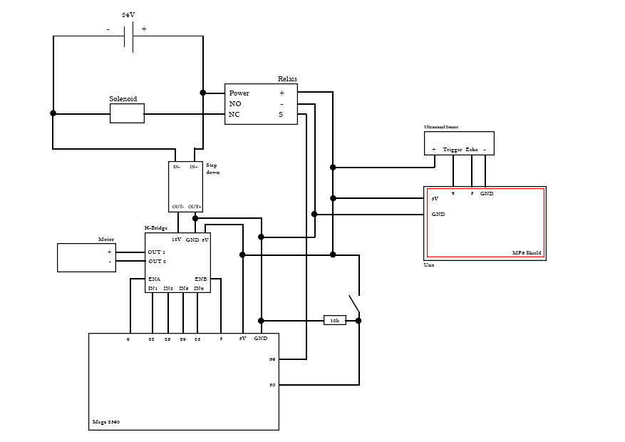

# Saltapult

Project documentation for the **Design for Physical Prototyping** course 2022/23 focusing on the topic of **Uncomfortable Devices**.

## Abstract

- Missing

Shortly summarize the intentions and ideas behind your project. 
Lorem ipsum dolor sit amet. This project builds upon the idea of [Chindōgu](https://en.wikipedia.org/wiki/Chind%C5%8Dgu), the practice of inventing ingenious everyday gadgets that seem to be ideal solutions to particular problems, but which may cause more problems than they solve. Lorem ipsum dolor sit amet.

## Concept

The initial brainstorming in the DPP course paved the road for the Saltinator. While the first ideas where rather tame, it didn't take long to end up with some crazy concepts which are impossible with current technology. But this information dumping helped with coming up with something that was actually buildable.

After a private remote session we reduced our possible candidates to three ideas.
* A hairdryer attachment that insults you when you use the highest setting.
* A odorizant that tells you about their feelings and what kind of problems they are facing currently.
* A self driving vacuum cleaner that insults you and some other features that have been lost in translation.
* A date buddy that analyzes your breath and sprays peppermint breath refresher accordingly.
* ... and finally a laundary basket that throws the laundary back at you once it's full and also keeps insulting you.

In retrospect it's pretty clear that the "insulting" part was our main driver for most ideas, which most likely pairs with that fact that the idea of an insulting machine seems uncomfortable at first, but in the end it's actually quite the opposite. We insult each other all the time, it's a form of comedy and it's especially hard to convey these often highly emotional outbursts through cheap speakers and with no facial impressions.

### Underlying Motivation

The laundary basket is an object that gets way too full and never fully cleared, which is a problem. To solve this, the Saltinator not only limits the amount of dirty laundary that can be placed inside, but also reminds the user by tossing all it's contents once it's too full. To further make the user uncomfortable, it insults them everytime they place an item in the basket. The individual user can freely device where this device makes the most sense, especially since it's somewhat space-saving.

### The Initial Plan

The biggest issue was conceptualizing how the launching mechanism works. Due to the box shape we did not want to use a vertical approach. So instead we first theorized over using secondary wooden plate that is pulled towards a motor using a rope which gets cut, causing the launch. The springs were located in the bottom. To reduce the stress on the rope and motor we also wanted to fixate the moving plate using some sort of mechanism, which required a good chunk of research. If the motor did not bring enough torque we would have oppted for a more used centered approach, having the user fixate the plate. Another problem that came up immediately was using the razor, as the rope needs to be replaced, either automatically or by the user. For the indication we initially planned on using an infrared sensor that checks if the signal is interrupted. If the interruption is short it will play an insult. A longer time period will trigger the launch sequence.

## Implementation

With the concept our next step was to create the box and implement the needed components. To do so, several iterations were needed to get the electronic working.
Bevore we could start with the project a simple version of our concept needed to be created. This first prototype should be simple to created, present the main function of the concept and should be fast built. To do so the first test system was built.

### Cardboard prototype

The first prototype is basically build with a shoebox. A smaller box is used as base plattform for the main box. A plastic asian delivery food box is used for putting the cloth in. The plastic box is glued down to the smaller cardboard box. To build the catapult system four hookes are screwed in the cornes of the smaller box and four to the top of the shoebox. Another hooked is screwed in the middle of the bottom side of the smaller box. To make sure that someone can pull down the smaller box, a hole is made in the middle of the bottom side of the shoebox. A string is put through the hole connected to the hook at the bottom side of the smaller box. To make the catapult work four rubber bands are used as springs to create a connection between the four hooks at each box. To refill the box cut a hole in the same size of the plastic into the top of the shoebox. To test the catapult, objects are placed into the plastic box and string is pulled down. Let the string out and the box is going upwards.

With the first prototype we found out that we can not build the catapult with cardboard. Cardboard is not robust enough and so we decided to go with wood and do further tests with it.

### Testing components

To get a better understanding of how the components work and how to use them together the components were tested.
In this subsection describes the components and how they got tested and used.

The first component we tested is the infrared receiver. If infrared light hits the reiceiver, a signal is generated which can be detected and used from the arduino. Becuase of the short distance which they receiver needs to detect the light we decided to take an ultrasound sensor. The advantage of the ultrasound sensor is that it can detect detect interrupts more easily. The basic funcionality of an ultrasound sensor is that is sends out an ultrasound which get reflected. When the reflection hits the ultrasound sensor a distance is calculatet with the time which past until the sound got recognized. Using this funcionallity allows to detect when the distance is changing and react to it. To connect the ultrasound sensor to the arduino only four wires are needed; one to the voltage source (5V), one to the ground and the other twos to a choosen digital output.

The next step was to try out the motor. We needed to figure out how much voltage and current it needs. To do so we connected the motor to a laboratory power supply with 12V. To messure the needed current wo contected a multimeter in series with the engine and the power supply. The result was 0.2A so a good value for using a 12v power supply. To test the strength of the motor we glued a string to the shaft of the motor and put some weight on it. It is possible with the motor to lift up a screw jack. We tested the motor with the new 12V power supply but after realizing that we also need a mechanic to hold the plate which needs at least 24V we needed to change the power supply. As power supply we got a 24V one. To regualte the voltage a step down is used. A step down is a component which gets a input supply and regulates the voltage over a turning resistor. To get the right voltage the input of the step down was connected to the power supply, the output to the multimeter. To set the right voltage a screw has to be turned. 

To be able to controll the motor a H-Bridge is used. This component gets an input voltage and has a 5V output. There are four outputs which allows to connect two motors. To controll the H-Bridge six pins are connected to the arduino. Setting two of the four controll pins (LN1-LN4) to HIGH activates the rotation of the motor. The connections ENA and ENB are used to set the speed.

As realease meachnism a solenoid is used. If voltage is inductaded the shift is able to to move allows to hold our plate. To test the funcionality the solenoid is connected to the laboratory power supply which has an output of 24V. To avoid that the solenoid is activated to long we decided to take the black shaft instead of the screw shaft. The solenoid only has an input and output, so a relais is needed to switch the state of the solenoid. To do so the power supply is connected to the relay. The relais has two outputs normally open (NO) and normally closed (NC). To get the effect of a button the solenoid needs to be conected to the normally open conection, because this one get only activated after the arduino puts the output to high. Normally closed is already connected to the power supply and would get to the open state after the arduino sends a high signal. To test the relais-solenoid combination the power supply and the arduino are getting connected to the relais. The solenoid is connected with with ground (GND) and the normally open pin on the relay. Checking the funcionality is simple, just upload the the Relay code to the arduino.

For insulting we used the sparkfun mp3 audio shield. This is a shield is made for the Arduino Uno. It is designed to fit perfectly to the contection of the Arduino Uno, thus no wires are needed. To receive a sound headphones where used in the first iteration. To use the shield the mp3 library of the shield needs to be importat to the arduino software. To test it, one of the example codes can be used. We used the "Filereader" to test if the shield is working. To use it for our own project the setup as well as the start playing part were copied from the "Filereader". To improve audio an old speaker is used. Creating the insults for the shield is tricky but knowing that only mp3 and wav data is working gathering audio samples was not that bad. To get the samples a text-to-speach online service is used. The insults are from online forms and are mostly about smelling. The client service allows to put in the insults as text and can directly be downloaded as mp3. The file name needed to be changed to a format like 000x.mp3 or 000x.wav. A sd card with a maximum of 32GB is used for storage. 

The mp3 shield gave us some problem, see chapter Learnings. To get rid of the problems a second arduino is used. The arduino Uno is used to check the interrupts with the ultrasound sensor and plays the according audio. The Mega 2560 is used to controll the motor and the solenoid. To make sure that the Mega knows when it is allowed to enable the solenoid a communication between uno is necessary. We tried two different approach: directly communication via digital outputs (UART) and via communication pins (I2C). A sample code of a slave and master system is in the Code folder.

The last component we needed to test are the springs. We bought several kinds of springs at the local tool shop. We chooesed steel springs with a length of 4cm. For testing we took two wood bars and screwed four hooks in each. The springs are connected to the hooks. We tested the strength of the springs by trying to pull the two bars apart by hand and with the motor. Both worked pretty well and so we decided to go with the choosen springs.

### Presentation prototype

After testing all components and how we have to use them, it is finally time to build our prototype. 
Before we started to connect all the components a wiring plan was created, see figure []. This avoid putting the wrong wire to the wrong pin and also helps to understand what needs to be connected to to which component. To avoid any damage to the components a switch toggler was build in to have the opportunity to turn off the whole thing just with one whip. We could also plug out the power supply but that would take longer and also some times it is difficult to get the plug out realy fast.

#### Code
In the folder Code are all the code snipets which where used for testing the components. The task for the final prototype was to combine all the snippets to one file, or in our case in two files.

##### Uno
The job of the uno is to detect if something is thrown in the box. If so the distance, which gets detected from the ultrasound sensor, changes and the uno activates the sound modul. The plastic box has lenght about 25cm. To avoud that the arduino gives activates the signal all the time it should only do so when the distance is shorter than 20cm. The goal here was to detect the point when the box is full. There are two possible ways to do so: if the distance is shorter than 20cm wait some seconds and check it again; or using a counter to detect if the distance is still shorter and after a given value the arduino knows that the box is full.
We tried both solution and found out that checking the distance and waiting for some time is not the best solution. It is possible that you throw something in and after some seconds you throw again something in which would be detected as a full box. Therefore, the interruption counter is our solution. If something changes the distance below 20cm the counter is increased by one. In the next loop the distance is checked again, if it is still below 20cm than the counter is increased again by on, otherwise the counter is set to zero. If the counter reaches a value of onehundred the systems detects it as full and a self-destruction sound is played which would lead to enable the solenoid and activating the catapult.

##### Mega
The main job of the mega is to enable the solenoid; activating the motor to coil up the string which brings the plate to a certain position; deactivate the solenoid to hold the plate; rotate the motor in the opposit direction to unwind the string to avoid that the motor will be draged by the plate, and wait until the uno sends a signal to start the catapult process which enables the solenoid and shoots the plate upwards. The base input is to send a HIGH signal over a digital output to the solenoid to enable it. To turn the motor the four output pins need to be set to a predefined configuration of HIGH and LOW which leads to a left or right rotation. The ENA and ENB decide how fast the motor is rotating. To avoid a abrupt start and stop the values of ENA and ENB are in-/decreased with a for loop. The duration of the motor is set by a time limit.

#### Contingency plan
While building combining the components and create one code a problem occured. The communication between both arduinos stopped working.
Although it worked before in the combined version a error occured and it was not possible to send data from one arduino to the other one. Even with the base version of just setting a digital output. Therefore, a new solution was need. A button was the simpliest way to demonstrate the funcionality of the system.
With this new element the behavior of the code from the Mega changed just slightly. Instead of waiting at the signal from the Uno, now the button is used to represent this communication. When it is pressed the solenoid is activated and the platform is able to move upwards.

Another problem was, that normally a gear is used to mount an object to the shaft of the motor. We could not get a gear for our project. Therfore, we needed to think about a solution to mount our winch to the motor. Our first idea was to design a wench in a 3D programm like Fusion and print it with a 3d printer. We withdrawed this idea because we had no 3D printer in reach. Another idea was to craft something on our own. We took a regular plastic bottle and cut off the bottleneck. A soldering iron was used to create a hole into the bottle cap. To create the winch cardboard and foam rubber was cutted into circles and glued to the bottleneck. To mount the string to the bottleneck a hole was created with the soldering iron. The string is pushed through the hole and fixed with a washer (Beilagscheibe). At the end the bottlecap was assembled to the motor shaft and the bottleneck to the cap.

#### Building the box

As with most things beginning turned out to be quite difficult. It was pretty clear from the get-go that we'd use wood as the main structural material, not only for it's durability, but also ease of access. We had to consider the g-forces that get applied to the material when the motor pulls the platform towards the ground and releases it. Similar stress is placed on the solenoid, trying to hold the platform down. One concern we initially had was the weight, especially considering the quality of rope we'd use and how the motor truly is, which quickly became obsolete as mentioned in the other tests. Luckily we both had quite an array of broken wood furniture, old unused processed wood pieces and other wooden elements that could be used.

#### Measuring & Praying

We figured it made the most sense to measure all parts and calculate a minimum width and height for the base. We had to make a choice however. Do we want to add the supporting pieces lenght- or widthwise, which depended on two main factors. Considering we only had one solenoid it would make more sense to place it on the length side, as the wiggle room would be reduced by quite a margin. The other problem is that we only have two supporting rails, making it quite difficult to find a promising position for all of these parts. Additionally - thinking we initially had two solenoids - it did not make much sense to place both of them on the width side, because the overall length of the prototype would be quite large. After some brainstorming we came to a conclusion:

We switch from a box approach to only having four supporting towers, allowing people to see the inner workings of our prototype and also easier debugging. Only having one solenoid combined with the open space and only having two rails further drove into one possible build configuration: Place the support on the length side, add supporting rails diagonally from each other and place the solenoid to the width side. With the initial headaches out of the way we finally started building and choose a big green wooden piece as the base of our prototype.

#### Fixating the motor

The first task we tackled was fixating the motor. We started by measuring the wooden base and finding the center, which was important for the placement of the rope to avoid torgue towards the sides and unnecessary stress for our components. We also needed to consider the height of the motor holding component as it might have interfered with the movable platform if the supporting pedestals are not high enough. Furthermore, we also needed to securely mount the motor to hold steady, while simultaneously not break the motor holder due to the stress applied.

#### The presentation
While building the box of the prototype we found out that the wrinch is not that stable as it should be. The motor is able to rotate it without trying to pull down the plate, but with the plate the force of the springs was to much and the winch stayed on the same position. The other thing we noticed is that one solenoid is not enough to hold the plate. Therfore, we decided to go with a prototype which just shows how it should work. The solenoid and the motor never interact with the hanging plate and so no force is used to it. To show how the initial idea works the user has to pull down the plate and hold it until someone press the button.

At the presentation we got a lot of feedback of how well designed it. Everyone liked the idea and know exactly which problem we adressed.
Even the mechanism did not work as planned everyone understood what we tried to do and liked it. The highlight was definitly the insults.
The presentation time was great because we were able to display our prototype and talk about our ideas and steps and what we learned while building it. 

## Materials and tools

The main materials for this project were reused. All the components from the box where made out of wood which we already had at home such as from old chairs, shelves and a fance. A list of all components used are displayed in the table below:

### Material liste

## Learnings
While building our prototype a lot of new things were learnt such as how the components werke, how to write arduino code or even how to design a mechanism.
Sometimes you need to think out of the box to find a solution like the whench. even though there are some tutorials out there who show how to use the different components, combining them is another step and sometimes leads to some problems. This chapter summs up our learnings and should be a help for people who try to do something similar we did.

The first thing we definitly learnt is that you need to try things out. Connect it with a power supply and look what it does. It helps a lot to understand the behavior of the component and how it can be used. We did that several times such as the ultrasound sensor, the motor or even with the solenoid.

Another thing would be that looking up for already existing code helps a lot to test things out. There are a lot of different codes out there for the components. To analyze them and make it for the project helped a lot to create the final code script. Even though some tutorials are not that helpfull, some of them can safe a lot of time. Also YouTube is your best friend.

The most difficult part was the mp3 shield. The reason why it was so complicated is that the uno has less output pins. The shield uses some of them and the provided document from sparkfun did not help a lot. They dont describe which pins are used and which one are free. Therfore, we tried to figure out which pins are needed for playing audio with the speaker. At the end, the shield needs all digital pins expect of PIN 4/5 and all analog pins. The pins are already used by the ultrasound sensor so there were no free pins for the other components. To make things more easy we changed the arduino from Uno to Mega 2560 which has more digital output pins and would fit perfectly for our projject. But, although there were a documentation about how to connect the shield with the Mega the shield did not work. After two and a half day of trying out different ways to connect the shield with the Mega, even changing some parts in the original library, the shield did not work. So to make our project working we decided to use both Arduinos to get the best of both. 

The mp3 shield also has some strange behaviors we could not fix. Like the sound was a big problem until the presenation. We fixed it 5 minutes before presentation because in the documentation was mentioned to set the volum to 255 to get the maximum volume. We found out that setting the volum with MP3player.setVolume() needs a value of 0 to get the maximu audio. There is also a problem with playing the audio. To do so, the name is put in the play() function. The library needs a Char array type, but rhe software Arduino does not have a char array. So putting a string in it does not work. To fix this problem, a switch state is used with a number as counter. Each state represants a path to the audio file. 

We also learnt a lot while building the box. Components like the motor or the solenoid need a special plate to fix it to a frame or plate. Typically this holding is made out of metal to provide stability. We had no metall plates so we decided to use wood. To mount them to holding system, the motor and the solenoid has holes to assemble it to the metal plates. We could not use this holes, thus we built a cages for both components to lock them. The biggest problem with both components was the traction of the springs. They were so strong that the motor was pulled up and the wench did not work. To avoid that we could print a better fitting wench which get screwed down to the shaft of the motor and use metal to lock the motor. The solenoid had the problem that the plate tipped over and at the point of fixation a lot of traction arise. Thus, the traction was so strong that the solenoid could not be activated anymore and the plate did not move anymore. To avoid that problem instead of using one solenoid at least two of them should be used. Maybe schanging the springs to weaker ones could also help to reduce the tranction and so make the release better.

Overall it was a good way to refresh allready known knowledge and to learn new things.
It also showed that having a plan helps a lot to build projects faster than just put things in a box and hope that it will be working.

## Conclusion

Even though one teammate left the team we were able to create a prototype which showed our idea of a box which throws out stuff when it is full.
Allthough, not everything worked as planned we learned a lot of new things an had a lot of fun creating the prototype.
While the presentation we definitly saw the potential of our project. This box can be used for multiple options like throwing out stones, leafes, dice and way more.
Also the insults where a good way to bring a smile to the users. Maybe not that cool when an alarm wakes you up middle in the night so you know that you have to much cloth in your box. But in the end everybody liked the concept and result we had presented.

Looking back at the concepts we would change a lot to improve our prototype to get a better result. But thats typicall the thing you do when you are starting with project; try stuff out and if it is not working try another way to do it. We would definitly try out other springs and improve the wrench with a 3D printed version. Instead of using one solenoid we woud increase the number to two and maybe more. Instead of using wood PU plates would be more suitable and lighter. 
the MP3 shield worked well but there is definitly a better way to do that and replacing it would help to have only one Arduino and maybe improve the audio a little bit.

The next steps are now takeing the learnings from the project and build upon it to create a box which throws the dice in the air so you dont have to throw it anymore. 
Thus, the box can be way more smaller and the materials dont need to be that stable because of the lesser weight of the dice.

{: .note }
Edit this page and all the subpages according to the specifics of your project. You don't need to use the provided headlines, just keep it well structured. If one part of the documentation gets too lengthy put it into a subpage.
